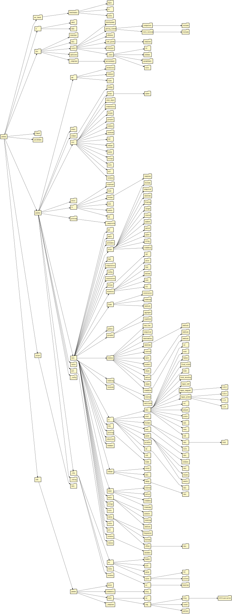

# Directory Grapher

Create directory graphs representing any directory of your choosing.

## Gallery

To see a Gallery of directory graphs of popular repositories on GitHub, see the [Directory Grapher Wiki](https://github.com/AlexEidt/Directory-Grapher/wiki) or check out the corresponding [Youtube Video](https://www.youtube.com/watch?v=zlxg3gx0A_0).

The Directory Graph for the [Pandas](https://github.com/pandas-dev/pandas) directory is shown below.



## Usage

Run `dir.py` in a directory that contains directories you'd like to visualize. Replace `DIRECTORY_LOCATION_HERE` with the file path to the directory you've chosen. You can run it from the command line or via the console.

```
cd DIRECTORY_LOCATION_HERE
python dir.py
```

The command line arguments are shown below.

```
usage: dir.py [-h] [-o O] [-d D] [-hidden] [-m] [-f] [-ot OT] [-rs RS] [-ft FT] [-r] dir

Visualizes directory structure with graphs.

positional arguments:
  dir         Directory Name.

optional arguments:
  -h, --help  show this help message and exit
  -o O        Output file name.
  -d D        Visualization Depth. Default -1.
  -hidden     Include hidden directories (starting witih "." or "__").
  -m          Show number of files/dirs and memory use.
  -f          Show files in each directory.
  -ot OT      Graph orientation. Either TB, BT, LR, RL. Default TB.
  -rs RS      Distance between "layers" of directories in inches.
  -ft FT      File Format to render graph as either "svg" or "png". Default "svg".
  -r          Render graph online via the quickchart.io API.
```

### Options

Demo Graph with Data and Files Shown | Demo Graph with only Data shown
:---: | :---:
 | 
**Demo Graph with only Files Shown** | **Demo Graph with neither Data or Files Shown**
 | 

### Orientations

Note that all combinations of parameters are compatible with all combinations of orientations.

Bottom to Top | Top to Bottom
:---: | :---:
 | 
**Left to Right** | **Right to Left**
 | 

### Depth Limiting

Note that all combinations of parameters with all combinations of orientations are compatible with any depth.

1 | 2
:---: | :---:
 | 
**3** | **All (Default)**
 | 

Note that if you enter a depth that is greater than the total levels in the directory, all levels will be visualized.

## Documentation

In order to create the directory graphs call the `graph_dir` function in `dir.py` and fill in the variable names with the desired parameters.

```python
graph_dir(
    directory_name,
    orientation=orientation,
    data=data,
    show_files=show_files,
    show_hidden=show_hidden,
    max_depth=max_depth,
    ranksep=ranksep,
    file_type=file_type,
    render=render
)
```

### Arguments

Argument | Default | Description
--- | --- | ---
`directory_name` | N/A | The name of the directory you'd like to create a graph for. Directory must be present in the same directory as the `dir.py` script or else an `AssertionError` will be thrown.
`orientation` | `'LR'` | The orientation of the graph. Must be either `'LR'`, `'RL'`, `'BT'`, or `'TB'`. If `orientation` is none of those values, an `AssertionError` is thrown.
`data` | `False` | If `True`, show number of sub-directories and files in each folder, as well as the memory use of each directory and file. If `False` display none of this information.
`show_files` | `True` | If `True` show all files in each directory. If `False`, show no files. 
`show_hidden` | `False` | If `True` include hidden directories (those starting with `__` or `.`) and their contents in the visualization. If `False`, do not show any hidden directories.
`max_depth` | `-1` | If this value is negative or `0`, the entire directory structure will be visualized. Otherwise, the directory depth will stop at a the value passed in by the user. I.e, if the user passes in `1` as the `max_depth`, then the visualization will only show the immediate files and folders inside of the root folder and none of the subfolders.
`ranksep` | `None` | Distance between "layers" of directories in inches.
`file_type` | `'svg'` | File type to render graph as. Must be either `'svg'` or `'png'`.
`render` | `True` | If `True` render graph using GraphViz, otherwise will use the `quickchart.io` API. Useful if you do not want to install the GraphViz binaries.

## Quickchart

The QuickChart.io GraphViz API documentation is here: https://quickchart.io/documentation/graphviz-api/.

Quickchart may not work for larger graphs. It may also not be suitable to send your directory data over the internet either.

## Dependecies

* [Python 3.7+](https://www.python.org/)
* [GraphViz](https://graphviz.gitlab.io/download/)
* [Requests](https://docs.python-requests.org/en/latest/)

```
pip3 install graphviz requests
```

## GraphViz Note

In order for the visual representation with Graphviz to work, Graphviz must be downloaded. Download GraphViz here: https://graphviz.gitlab.io/download/. Once downloaded go to `dir.py` and change the System Path under `GRAPHVIZ PATH SETUP`. Replace `'C:\\Graphviz\\bin'` with the path to the bin folder of the downloaded GraphViz folder.

```python
# Change PATH setup for Graphviz directory here:
# --------------------------GRAPHVIZ PATH SETUP------------------------- #
os.environ['PATH'] += os.pathsep + 'C:\\Graphviz\\bin' # <-- Replace this
# ---------------------------------------------------------------------- #
```