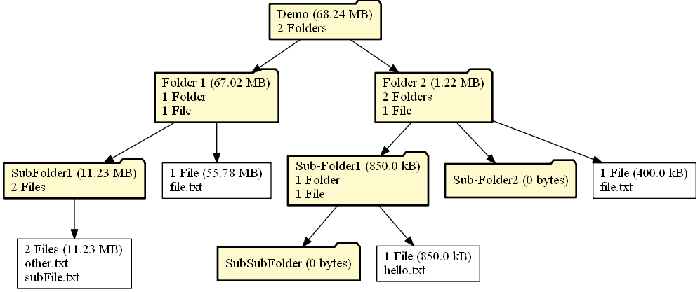
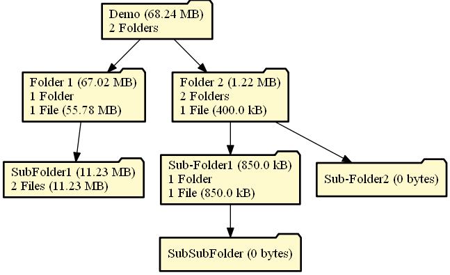
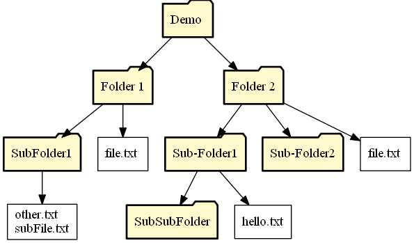
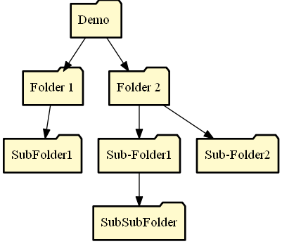
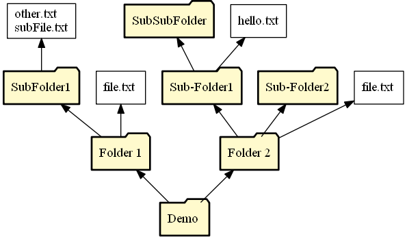
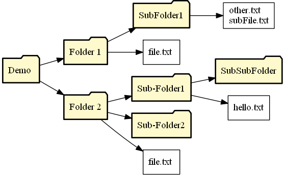
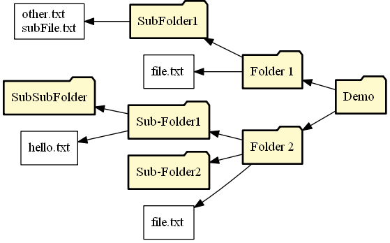
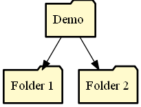

# Directory Grapher

Create directory graphs representing any directory of your choosing.

## Usage

Run `graph_dir.py` in a directory that contains directories you'd like to visualize. Replace `DIRECTORY_LOCATION_HERE` with the file path to the directory you've chosen. You can run it from the command line or via the console.

```
cd DIRECTORY_LOCATION_HERE
python graph_dir.py
```

The command line arguments are shown below.

```
usage: graph_dir.py [-h] [-i] [-d D] [-hidden] [-m] [-f] [-o O] [-rs RS] [-ft FT] dir

Visualizes directory structure with graphs.

positional arguments:
  dir         Directory Name.

optional arguments:
  -h, --help  show this help message and exit
  -i          Use console interface instead of command line args.
  -d D        Visualization Depth.
  -hidden     Include hidden directories (starting witih "." or "__").
  -m          Show number of files/dirs and memory use.
  -f          Show files in each directory.
  -o O        Graph orientation. Either TB, BT, LR, RL.
  -rs RS      Distance between "layers" of directories in inches.
  -ft FT      File Format to render graph as either "svg" or "png".
```

The console interface looks like this:

```
Welcome to the Directory Grapher!

Enter a directory name that is in this directory. Valid directory names are given below:
         .git
         .vscode
         Demo
         Documentation
directory Name: Demo

Enter Maximum Directory Depth. Must be an integer. (Enter/Return for no limit):
Would you like to include hidden directories (starting with "." or "__") in the visualization? (y/n): n
Show number of files/directories and memory use for each directory? (y/n): y
Show files in each directory? (y/n): y
File Type (png or svg): svg
Distance between "layers" of directories in inches (Enter/Return for Default):
How should the graph be oriented? 
Top -> Bottom: TB
Bottom -> Top: BT
Left -> Right: LR
Right -> Left: RL
Choose one of the options above and enter here: LR

The directory graph (Demo_Graph.png) has been created in this directory.
```

As you'll see in the log above, there are several options to customize the graph that is created. It's possible to show data for each directory (the number of sub-directories and files in that directory, as well as the memory use of each file and directory). The user may also choose to show or hide the files in each directory. The user may also choose the orientation of the graph, whether it should start at the bottom and go up, start at the top and go down, start left and go right, or start right and go left. The user can also limit the directory depth for visualization, which may be useful for large directories with many levels of subdirectories.

### Options

Demo Graph with Data and Files Shown | Demo Graph with only Data shown
:---: | :---:
 | 
**Demo Graph with only Files Shown** | **Demo Graph with neither Data or Files Shown**
 | 

### Orientations

Note that all combinations of parameters are compatible with all combinations of orientations.

Bottom to Top | Top to Bottom
:---: | :---:
 | 
**Left to Right** | **Right to Left**
 | 

### Depth Limiting

Note that all combinations of parameters with all combinations of orientations are compatible with any depth.

1 | 2
:---: | :---:
 | 
**3** | **All (Default)**
 | 

Note that if you enter a depth that is greater than the total levels in the directory, all levels will be visualized.

## Documentation

In order to create the directory graphs call the `main` function in `graph_dir.py` and fill in the variable names with the desired parameters.

```python
main(
    directory_name,
    orientation=orientation,
    data=data,
    show_files=show_files,
    show_hidden=show_hidden,
    max_depth=max_depth,
    ranksep=ranksep,
    file_type=file_type
)
```

### Arguments

Argument | Default | Description
--- | --- | ---
`directory_name` | N/A | The name of the directory you'd like to create a graph for. Directory must be present in the same directory as the `graph_dir.py` script or else an `AssertionError` will be thrown.
`orientation` | `'LR'` | The orientation of the graph. Must be either `'LR'`, `'RL'`, `'BT'`, or `'TB'`. If `orientation` is none of those values, an `AssertionError` is thrown.
`data` | `False` | If `True`, show number of sub-directories and files in each folder, as well as the memory use of each directory and file. If `False` display none of this information.
`show_files` | `True` | If `True` show all files in each directory. If `False`, show no files. 
`show_hidden` | `False` | If `True` include hidden directories (those starting with `__` or `.`) and their contents in the visualization. If `False`, do not show any hidden directories.
`max_depth` | `-1` | If this value is negative or `0`, the entire directory structure will be visualized. Otherwise, the directory depth will stop at a the value passed in by the user. I.e, if the user passes in `1` as the `max_depth`, then the visualization will only show the immediate files and folders inside of the root folder and none of the subfolders. This is useful for large directories with many levels of subfolders that would be incomprehensibly small on a visualization. In such a case, limiting the directory depth will make visuals much cleaner and easier to look at.
`ranksep` | `None` | Distance between "layers" of directories in inches.
`file_type` | `svg` | File type to render graph as.

## Dependecies

* [Python 3.7+](https://www.python.org/)
* [GraphViz](https://graphviz.gitlab.io/download/)

```
pip3 install graphviz
```

## GraphViz Note

In order for the visual representation with Graphviz to work, Graphviz must be downloaded. Download GraphViz here: https://graphviz.gitlab.io/download/. Once downloaded go to `graph_dir.py` and change the System Path under `GRAPHVIZ PATH SETUP`. Replace `'C:\\Graphviz\\bin'` with the path to the bin folder of the downloaded GraphViz folder.

```python
# Change PATH setup for Graphviz directory here:
# --------------------------GRAPHVIZ PATH SETUP------------------------- #
os.environ['PATH'] += os.pathsep + 'C:\\Graphviz\\bin' # <-- Replace this
# ---------------------------------------------------------------------- #
```